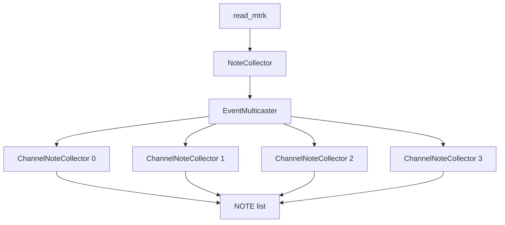

# NoteFilter

Now is the time to develop an `EventReceiver` subclass that
keeps track of all notes and generates `NOTE` objects
as it receives MIDI events.

MIDI events always take place on a certain channel.
For example, if there is a program change (= change of instrument)
on channel 5, it only affects notes played on channel 5.
Note on and off events can only be paired
if they occur on the same channel.

Keeping track of notes and instruments on all channels simultaneously
can become a bit complex. We therefore choose to split
up the code in separate classes.



(This is supposed to be a diagram. You can view it in Visual Studio Code
if you install the mermaid extension.)

* A `ChannelNoteCollector` will focus on a single channel and (mostly) ignore events
on other channels. It keeps track of instrument changes and notes. We will
need 16 different such `ChannelNoteCollector` objects, one per channel.
* A `EventMulticaster` is an object that receives events and broadcasts them to other
`EventReceiver`s. In our context, we will use it to broadcast events to all 16 `ChannelNoteCollector`s.
* A `NoteCollector` is responsible for the setup of the `EventMulticaster`
and 16 `CahnnelNoteCollector`s.

## `ChannelNoteCollector`

A `ChannelNoteCollector` derives from `EventReceiver`.
It receives all events,
focuses on those occurring on the 'right' channel,
keeps track of instrument changes and forms notes
based on note-on and note-off events.

For example, say we send it the following events using the code below:

```cpp
// Assume collector listens to channel 4
collector.program_change(Duration(0), Channel(4), Instrument(9));
collector.note_on (Duration(0)  , Channel(4), NoteNumber(5), 127);
collector.note_off(Duration(100), Channel(4), NoteNumber(5), 0  );
```

The `collector` should produce a `NOTE` with

<center>

| Field | Value |
|-:|:-|
| `note_number` | 5 |
| `instrument` | 9 |
| `start` | 0 |
| `duration` | 100 |
| `velocity` | 127 |

</center>

The default instrument is `0`, so if no `program_change` event
occurred, `0` is the instrument that should be assigned
to all subsequent notes.

Notes on the 'wrong' channel should be ignored:

```cpp
// Assume collector listens to channel 4
collector.note_on (Duration(0)  , Channel(4), NoteNumber(44), 70);
collector.note_on (Duration(0)  , Channel(5), NoteNumber(44), 80);
collector.note_off(Duration(100), Channel(5), NoteNumber(44), 0 );
collector.note_off(Duration(100), Channel(4), NoteNumber(44), 0 );
```

should produce one note:

<center>

| Field | Value |
|-:|:-|
| `note_number` | 44 |
| `instrument` | 0 |
| `start` | 0 |
| `duration` | 200 |
| `velocity` | 70 |

</center>

Make sure you understand why the `duration` is `200`, not `100`.

It should be clear that a `ChannelNoteCollector` should be
initialized with a channel so that it knows which channel
to keep an eye on. So, that's one constructor parameter.

Where does the collector send its `NOTE`s to?
We could have the collector store all the `NOTE`s in a `std::vector<NOTE>`,
but that would be making assumptions. Maybe the user of the collector
class want them in a `std::list<NOTE>`, or perhaps not store them at all
put directly print them out. So we need to ask ourselves the question,
what should the `ChannelNoteCollector` provide so as to maximize
reusability and flexibility?

One way would be to introduce the concept of a note receiver, which could be defined as

```cpp
class NoteReciever
{
public:
    virtual receive_note(const NOTE&) = 0;
};
```

This could work, but puts the additional burden on the user
of defining an extra class plus all additional complexity that goes with it.
For example, say we want the gather all `NOTE`s in a vector, we would have to write

```cpp
class ToVector : public NoteReceiver
{
private:
    std::vector<NOTE>* vector;

public:
    ToVector(std::vector<NOTE>* vector) : vector(vector) { }

    void receive_note(const NOTE& note) override
    {
        vector->push_back(note);
    }
};

std::vector<NOTE> notes;
ToVector receiver(&notes);
ChannelNoteCollector collector(Channel(5), receiver);
```

We can shorten this drastically by relying on lambdas:

```cpp
std::vector<NOTE> notes;
ChannelNoteCollector collector(Channel(5),
                               [&notes](const NOTE& note) { notes.push_back(note); });
```

Let's examine this lambda in detail. A lambda is nothing more
than a nameless function, meaning it has parameters, a body and a return value.

* `[&notes]` is the capture clause and lists all variables the lambda will
refer to inside its body. Since it has to be the actual vector and not a copy, we need
to capture `notes` by reference, hence the preceding `&`.
* `(const NOTE& note)` is the lambda's parameter list.
* `{ notes.push_back(note); }` is the body of the lambda.

The lambda does not return anything: in our context, it would have no point.

The advantage of using a lambda is that it is able to directly access
variables around it. Using classes, we need to manually pass around
pointers in order to provide similar access.

So, what does this mean for our `ChannelNoteCollector`?
Its constructor needs two parameters:

* The channel
* A function which it calls whenever a new note has been found

In order to be able to define this constructor, we need to know
how to express the second parameter's type. The syntax for a function type is:

```cpp
#include <functional>

std::function<ReturnType(ParameterType1, ParameterType2, ...) identifier;
```

In our case, the function needs to accept a `const NOTE&` and return nothing:

```cpp
std::function<void(const NOTE&)> note_receiver
```

You can simply pass a function by value (no need to use references or pointers).
Calling the function is done using the familiar syntax:

```cpp
NOTE note;
note_receiver(note);
```

## Task

To summarize:

* Define a `EventReceiver` subclass named `ChannelNoteCollector`.
* Give it a constructor taking a channel and a function.
* Implement all event-receiving member functions.
* Keep track of instrument changes and notes.
* Each time a note has been found, call the provided function.